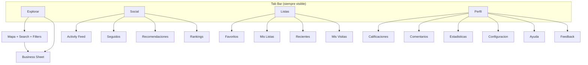
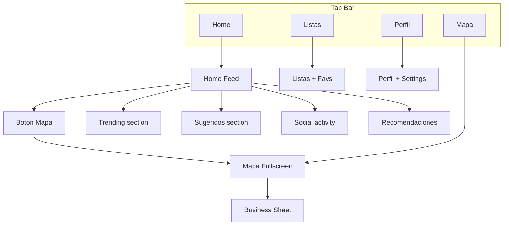
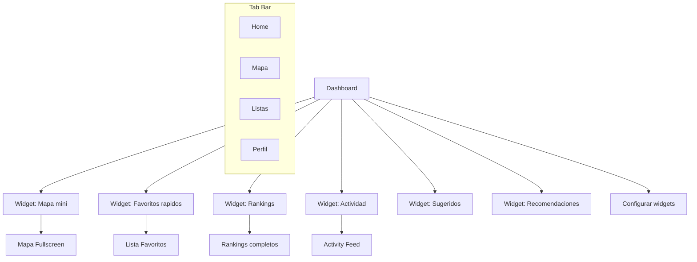
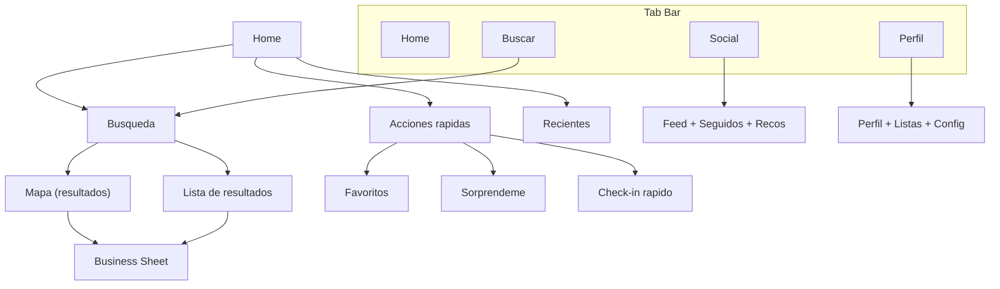

# Rediseno del Home: Alternativas al Mapa Central

**Issue:** [#158](https://github.com/benoffi7/modo-mapa/issues/158)
**Fecha:** 2026-03-25
**Estado:** Propuesta para evaluacion

---

## Estado Actual

### Estructura de navegacion

```
+--------------------------------------------------+
|  [=] Buscar comercios...                    [bell]|
|  [tag1] [tag2] [$$] [$$$] ...                     |
|                                                    |
|                                                    |
|            MAPA FULLSCREEN                         |
|          (Google Maps + markers)                   |
|                                                    |
|                                                    |
|                                         [loc] [ofc]|
+--------------------------------------------------+
|        BOTTOM SHEET (business detail)              |
|  Nombre | Direccion | Rating | Tags | Comentarios |
+--------------------------------------------------+

SIDE MENU (swipe left):
+---------------------------+
| Avatar  Nombre            |
| [Crear cuenta]            |
| [Onboarding checklist]    |
|---------------------------|
|  1. Pendientes            |
|  2. Favoritos             |
|  3. Mis Listas            |
|  4. Recientes             |
|  5. Mis visitas           |
|  6. Sugeridos             |
|  7. Sorprendeme           |
|  8. Seguidos              |
|  9. Actividad             |
| 10. Recomendaciones       |
| 11. Comentarios           |
| 12. Calificaciones        |
| 13. Feedback              |
| 14. Rankings              |
|---------------------------|
| 15. Estadisticas          |
| 16. Agregar comercio      |
| 17. Configuracion         |
| 18. Ayuda                 |
|---------------------------|
| Politica de privacidad    |
| [Dark mode toggle]  v2.30 |
+---------------------------+
```

### Problemas del diseno actual

| Problema | Impacto |
|----------|---------|
| 19 secciones en un drawer oculto | Baja descubribilidad de features |
| Todo detras de hamburger menu | Requiere 2+ toques para cualquier seccion |
| Mapa fullscreen siempre visible | Ocupa espacio incluso cuando el usuario no lo necesita |
| Sin jerarquia visual de secciones | Todas las opciones se ven igual de importantes |
| Onboarding solo en el drawer | Usuarios nuevos no descubren features |
| Social (seguidos, actividad, recomendaciones) enterrado | Engagement social bajo |

### Acciones mas frecuentes (estimacion)

| Accion | Toques actuales |
|--------|-----------------|
| Buscar comercio | 1 (tap search) |
| Ver mapa | 0 (ya visible) |
| Ver favoritos | 2 (menu + favoritos) |
| Ver actividad social | 2 (menu + actividad) |
| Ver rankings | 2 (menu + rankings) |
| Calificar comercio | 2 (tap marker + rate) |
| Ver listas | 2 (menu + listas) |
| Ver recomendaciones | 2 (menu + recomendaciones) |
| Check-in | 3 (marker + sheet + check-in) |

---

## Alternativa A: Tab Navigation

Reemplazar el drawer por una barra de tabs inferior. El mapa sigue siendo una tab, pero comparte protagonismo con otras secciones.

### Diagrama de navegacion



### Wireframe

```
+--------------------------------------------------+
|  Buscar comercios...                        [bell]|
|  [tag1] [tag2] [$$] [$$$]                         |
|                                                    |
|            MAPA (o contenido de tab activa)         |
|                                                    |
|                                                    |
+--------------------------------------------------+
| [Explorar]  [Social]  [Listas]  [Perfil]          |
+--------------------------------------------------+
```

**Tab Explorar:**
```
+--------------------------------------------------+
|  Buscar comercios...                        [bell]|
|  [tag1] [tag2] [$$] [$$$]                         |
|                                                    |
|               MAPA + MARKERS                       |
|                                                    |
|                                         [loc] [ofc]|
+--------------------------------------------------+
|  Sugeridos: [biz1] [biz2] [biz3] -->              |
+--------------------------------------------------+
| [*Explorar*] [Social]  [Listas]  [Perfil]         |
+--------------------------------------------------+
```

**Tab Social:**
```
+--------------------------------------------------+
| Social                                      [bell]|
+--------------------------------------------------+
| [Actividad] [Seguidos] [Recomendaciones] [Rankings]|
+--------------------------------------------------+
|                                                    |
|  @maria califico Bar Central *****                 |
|  @pedro agrego Lista "Brunch spots"                |
|  @ana hizo check-in en Cafe Roma                   |
|                                                    |
|  [Ver mas...]                                      |
+--------------------------------------------------+
| [Explorar]  [*Social*]  [Listas]  [Perfil]        |
+--------------------------------------------------+
```

**Tab Listas:**
```
+--------------------------------------------------+
| Mis Listas                            [+] [bell]  |
+--------------------------------------------------+
| [Favoritos] [Listas] [Recientes] [Visitas]        |
+--------------------------------------------------+
|                                                    |
|  * Favoritos (12)                                  |
|  * Brunch spots (5) - compartida                   |
|  * Pizzerias (3)                                   |
|                                                    |
+--------------------------------------------------+
| [Explorar]  [Social]  [*Listas*]  [Perfil]        |
+--------------------------------------------------+
```

**Tab Perfil:**
```
+--------------------------------------------------+
| Mi Perfil                                         |
+--------------------------------------------------+
| [Avatar]  Gonzalo                                  |
|           12 calificaciones | 5 comentarios        |
|           Nivel: Explorador                        |
+--------------------------------------------------+
|  Calificaciones                                >  |
|  Comentarios                                   >  |
|  Estadisticas                                  >  |
|  Feedback                                      >  |
|  Configuracion                                 >  |
|  Ayuda                                         >  |
+--------------------------------------------------+
| [Explorar]  [Social]  [Listas]  [*Perfil*]        |
+--------------------------------------------------+
```

### Agrupacion de las 19 secciones

| Tab | Secciones incluidas |
|-----|---------------------|
| Explorar | Mapa, Search, Filters, Sugeridos, Sorprendeme, Agregar comercio |
| Social | Actividad, Seguidos, Recomendaciones, Rankings |
| Listas | Favoritos, Mis Listas, Recientes, Mis visitas |
| Perfil | Calificaciones, Comentarios, Estadisticas, Feedback, Configuracion, Ayuda, Pendientes |

### Toques por accion

| Accion | Actual | Alt. A |
|--------|--------|--------|
| Ver mapa | 0 | 0 (tab default) |
| Buscar | 1 | 1 |
| Ver favoritos | 2 | 1 (tab Listas) |
| Ver actividad | 2 | 1 (tab Social) |
| Ver rankings | 2 | 2 (Social + Rankings) |
| Ver listas | 2 | 1 (tab Listas) |
| Ver recomendaciones | 2 | 2 (Social + Recos) |
| Ver perfil | N/A | 1 (tab Perfil) |

### Pros y contras

| Pros | Contras |
|------|---------|
| Patron familiar (Instagram, Google Maps) | Pierde espacio vertical para tab bar (~56px) |
| Acceso directo a secciones principales | Sub-tabs dentro de tabs puede confundir |
| Descubribilidad inmediata de Social y Listas | Requiere refactor significativo del layout |
| Badge de notificacion visible en tabs | "Sorprendeme" pierde visibilidad |
| Mapa sigue siendo la pantalla default | 4 tabs puede ser insuficiente para 19 secciones |

---

## Alternativa B: Feed como Home

El home deja de ser el mapa y pasa a ser un feed personalizado con actividad reciente, trending y sugerencias. El mapa es accesible desde el feed.

### Diagrama de navegacion



### Wireframe

**Home Feed:**
```
+--------------------------------------------------+
| Modo Mapa                          [search] [bell]|
+--------------------------------------------------+
|                                                    |
| Hola Gonzalo!                                      |
|                                                    |
| -- MAPA PREVIEW (mini, 30% height) -----------    |
| |          [Ver mapa completo -->]            |    |
| |    . .  .   .  .                            |    |
| -----------------------------------------------    |
|                                                    |
| SUGERIDOS PARA VOS                                 |
| [Card biz1] [Card biz2] [Card biz3] -->           |
|                                                    |
| TRENDING                                           |
| 1. Bar Central  (28 ratings esta semana)           |
| 2. Cafe Roma    (15 ratings esta semana)           |
| 3. Pizza Napoli (12 ratings esta semana)           |
|                                                    |
| ACTIVIDAD DE TUS SEGUIDOS                          |
| @maria califico Bar Central *****                  |
| @pedro creo lista "Brunch spots"                   |
|                                                    |
| RECOMENDACIONES PARA VOS (2 nuevas)                |
| @ana te recomendo Cafe Roma                        |
|                                                    |
+--------------------------------------------------+
| [*Home*]  [Mapa]  [Listas]  [Perfil]              |
+--------------------------------------------------+
```

**Mapa (tab):**
```
+--------------------------------------------------+
|  Buscar comercios...                        [bell]|
|  [tag1] [tag2] [$$] [$$$]                         |
|                                                    |
|               MAPA FULLSCREEN                      |
|               (igual que hoy)                      |
|                                                    |
|                                         [loc] [ofc]|
+--------------------------------------------------+
| [Home]  [*Mapa*]  [Listas]  [Perfil]              |
+--------------------------------------------------+
```

### Agrupacion de las 19 secciones

| Ubicacion | Secciones |
|-----------|-----------|
| Home Feed | Sugeridos, Trending (nuevo), Actividad social, Recomendaciones, Sorprendeme (como seccion) |
| Tab Mapa | Mapa, Search, Filters, Business Sheet |
| Tab Listas | Favoritos, Mis Listas, Recientes, Mis visitas, Pendientes |
| Tab Perfil | Calificaciones, Comentarios, Rankings, Estadisticas, Feedback, Configuracion, Ayuda |

### Toques por accion

| Accion | Actual | Alt. B |
|--------|--------|--------|
| Ver mapa | 0 | 1 (tab Mapa) |
| Buscar | 1 | 2 (tab Mapa + search) |
| Ver favoritos | 2 | 1 (tab Listas) |
| Ver actividad | 2 | 0 (en Home) |
| Ver trending | N/A | 0 (en Home) |
| Ver sugeridos | 2 | 0 (en Home) |
| Ver recomendaciones | 2 | 0 (en Home) |
| Calificar (desde feed) | 2 | 2 (tap card + rate) |

### Pros y contras

| Pros | Contras |
|------|---------|
| Home rico en contenido y engagement | Mapa pierde protagonismo (es el core de la app) |
| Descubribilidad maxima de social y sugerencias | Usuarios que solo quieren el mapa pierden 1 tap |
| Patron moderno (TikTok, Instagram) | Feed requiere datos suficientes para no verse vacio |
| Onboarding natural (el feed guia al usuario) | Mas complejo de implementar (feed engine) |
| Recomendaciones y trending visibles sin buscar | Cold start problem: feed vacio para usuarios nuevos |

---

## Alternativa C: Dashboard Personalizado

El home es un dashboard con widgets configurables. El usuario elige que ver en su pantalla principal.

### Diagrama de navegacion



### Wireframe

**Dashboard (default):**
```
+--------------------------------------------------+
| Modo Mapa                    [config] [search] [b]|
+--------------------------------------------------+
|                                                    |
| +----------------------+ +----------------------+ |
| | MAPA (mini preview)  | | MIS FAVORITOS        | |
| |  [Ver mapa -->]      | |  Cafe Roma           | |
| |   .  . .  .         | |  Bar Central         | |
| +----------------------+ |  Pizza Napoli        | |
|                          +----------------------+ |
| +----------------------------------------------+ |
| | RANKING SEMANAL                               | |
| | 1. @maria (45pts)  2. @vos (38pts)  3. @ana  | |
| +----------------------------------------------+ |
|                                                    |
| +----------------------------------------------+ |
| | ACTIVIDAD RECIENTE                            | |
| | @pedro califico Cafe Roma ****                | |
| | @ana hizo check-in en Bar Central             | |
| +----------------------------------------------+ |
|                                                    |
| +----------------------+ +----------------------+ |
| | SUGERIDO:            | | RECOMENDACION:       | |
| | Heladeria Luna       | | @maria te recomendo  | |
| | ****  $$ Helados     | | Bodegon del Sur      | |
| +----------------------+ +----------------------+ |
|                                                    |
+--------------------------------------------------+
| [*Home*]  [Mapa]  [Listas]  [Perfil]              |
+--------------------------------------------------+
```

**Pantalla de configuracion de widgets:**
```
+--------------------------------------------------+
| Configurar Home                           [Listo] |
+--------------------------------------------------+
|                                                    |
| Arrastra para reordenar:                           |
|                                                    |
| [=] Mapa preview              [ON ]               |
| [=] Favoritos rapidos          [ON ]               |
| [=] Ranking semanal            [ON ]               |
| [=] Actividad de seguidos      [ON ]               |
| [=] Sugeridos                  [ON ]               |
| [=] Recomendaciones            [ON ]               |
| [=] Sorprendeme                [OFF]               |
| [=] Mis visitas recientes      [OFF]               |
| [=] Comentarios recientes      [OFF]               |
| [=] Estadisticas               [OFF]               |
|                                                    |
+--------------------------------------------------+
```

### Toques por accion

| Accion | Actual | Alt. C |
|--------|--------|--------|
| Ver mapa | 0 | 1 (tab o tap widget) |
| Ver favoritos | 2 | 0 (widget) o 1 (tab) |
| Ver actividad | 2 | 0 (widget) |
| Ver rankings | 2 | 0 (widget) |
| Ver sugeridos | 2 | 0 (widget) |
| Ver recomendaciones | 2 | 0 (widget) |

### Pros y contras

| Pros | Contras |
|------|---------|
| Maxima personalizacion | Complejidad alta de implementacion |
| Cada usuario ve lo que le importa | Requiere persistencia de config por usuario |
| Muy buena descubribilidad | Overhead de decision para el usuario |
| Widgets pueden mostrar datos "at a glance" | Usuarios nuevos no saben que configurar |
| Se diferencia de competidores | Mas superficie de bugs y mantenimiento |
| Escalable: nuevos features = nuevos widgets | Layout responsive complejo con widgets variables |

---

## Alternativa D: Mapa como Herramienta

El mapa deja de ser el home. Se accede al mapa desde la busqueda o como herramienta. El home es una pantalla liviana centrada en acciones rapidas.

### Diagrama de navegacion



### Wireframe

**Home:**
```
+--------------------------------------------------+
| Modo Mapa                                   [bell]|
+--------------------------------------------------+
|                                                    |
| Hola Gonzalo!                                      |
|                                                    |
| ACCIONES RAPIDAS                                   |
| +------------+ +------------+ +------------+       |
| | Favoritos  | | Sorprendeme| | Check-in   |       |
| |    (12)    | |     ?      | |   rapido   |       |
| +------------+ +------------+ +------------+       |
|                                                    |
| RECIENTES                                          |
| Cafe Roma - hace 2h                           >    |
| Bar Central - ayer                             >    |
| Pizza Napoli - hace 3 dias                     >    |
|                                                    |
| PENDIENTES (2)                                     |
| 1 calificacion por sincronizar                     |
| 1 comentario por sincronizar                       |
|                                                    |
| TU SEMANA                                          |
| 3 check-ins | 5 calificaciones | Ranking #4       |
|                                                    |
+--------------------------------------------------+
| [*Home*]  [Buscar]  [Social]  [Perfil]             |
+--------------------------------------------------+
```

**Buscar (con mapa):**
```
+--------------------------------------------------+
|  Buscar comercios...                               |
|  [tag1] [tag2] [$$] [$$$]                         |
+--------------------------------------------------+
| [Mapa] [Lista]                    (toggle vista)   |
+--------------------------------------------------+
|                                                    |
|  Vista Mapa:           Vista Lista:                |
|  +----------------+   +------------------------+  |
|  |     MAPA       |   | Cafe Roma  **** $$     |  |
|  |   . . .  .     |   | Bar Central *** $$$    |  |
|  |  .   .  .      |   | Pizza Napoli **** $$   |  |
|  +----------------+   +------------------------+  |
|                                                    |
+--------------------------------------------------+
| [Home]  [*Buscar*]  [Social]  [Perfil]             |
+--------------------------------------------------+
```

### Agrupacion de las 19 secciones

| Ubicacion | Secciones |
|-----------|-----------|
| Home | Favoritos (acceso rapido), Recientes, Pendientes, Sorprendeme, Mis visitas (resumen) |
| Buscar | Mapa, Search, Filters, Business Sheet, Sugeridos (en resultados) |
| Social | Actividad, Seguidos, Recomendaciones, Rankings |
| Perfil | Calificaciones, Comentarios, Listas, Estadisticas, Feedback, Configuracion, Ayuda |

### Toques por accion

| Accion | Actual | Alt. D |
|--------|--------|--------|
| Ver mapa | 0 | 1 (tab Buscar) |
| Buscar | 1 | 1 (tab Buscar) |
| Ver favoritos | 2 | 1 (Home quick action) |
| Ver actividad | 2 | 1 (tab Social) |
| Ver rankings | 2 | 2 (Social + Rankings) |
| Sorprendeme | 2 | 1 (Home quick action) |
| Check-in rapido | 3 | 1 (Home quick action) |

### Pros y contras

| Pros | Contras |
|------|---------|
| Home liviano y rapido de cargar | El mapa ya no es lo primero que ves |
| Acciones rapidas reducen friccion | Cambio de identidad de la app ("Modo Mapa") |
| Toggle mapa/lista en busqueda es moderno (Airbnb) | Usuarios del mapa puro pierden 1 tap |
| Menos carga de Google Maps al inicio | Duplicacion parcial entre Home y otras tabs |
| Social destacado con tab propia | El nombre "Modo Mapa" pierde sentido si el mapa no es central |

---

## Matriz de Comparacion

### Toques promedio para las 8 acciones mas frecuentes

| Accion | Actual | A: Tabs | B: Feed | C: Dashboard | D: Mapa Tool |
|--------|--------|---------|---------|--------------|--------------|
| Ver mapa | 0 | 0 | 1 | 1 | 1 |
| Buscar comercio | 1 | 1 | 2 | 1 | 1 |
| Ver favoritos | 2 | 1 | 1 | 0 | 1 |
| Ver actividad social | 2 | 1 | 0 | 0 | 1 |
| Ver rankings | 2 | 2 | 2 | 0 | 2 |
| Ver listas | 2 | 1 | 1 | 1 | 2 |
| Ver recomendaciones | 2 | 2 | 0 | 0 | 2 |
| Check-in | 3 | 3 | 3 | 3 | 1 |
| **Promedio** | **1.75** | **1.38** | **1.25** | **0.75** | **1.38** |

### Evaluacion por criterio

| Criterio | A: Tabs | B: Feed | C: Dashboard | D: Mapa Tool |
|----------|---------|---------|--------------|--------------|
| Descubribilidad de features | Alta | Muy alta | Muy alta | Media |
| Facilidad de implementacion | Media | Media-Alta | Alta | Media |
| Familiaridad del patron | Muy alta | Alta | Media | Alta |
| Riesgo de cold start | Bajo | Alto | Medio | Bajo |
| Escalabilidad (nuevas features) | Media | Media | Alta | Media |
| Mantiene identidad "Mapa" | Si | Parcial | Parcial | No |
| Impacto en engagement social | Alto | Muy alto | Alto | Alto |
| Carga inicial de la app | Igual | Menor | Menor | Menor |

### Recomendacion

**Para Modo Mapa, la Alternativa A (Tab Navigation) es el punto de partida mas seguro:**

1. Es el patron mas familiar para usuarios mobile
2. Mantiene el mapa como pantalla principal (tab default)
3. Riesgo bajo: no cambia la identidad de la app
4. Implementacion incremental posible (se puede migrar seccion por seccion)
5. Las alternativas B/C se pueden explorar como evolucion futura sobre la base de tabs

**Alternativa hibrida recomendada: A + elementos de B**
- Tab bar con Explorar (mapa), Social, Listas, Perfil
- Dentro de Explorar, agregar una seccion de "Sugeridos" debajo del mapa
- Feed social completo en tab Social
- Esto da lo mejor de ambos mundos sin perder la identidad del mapa

---

## Proximos pasos

1. **Validar con usuarios:** Compartir este doc y preguntar que patron prefieren
2. **Mockups visuales:** Llevar la alternativa elegida a v0.dev o Figma para mockups de alta fidelidad
3. **Prototipo navegable:** Crear prototipo clickeable para testear flujos
4. **Analytics:** Revisar datos de uso actual para informar la decision (que secciones se usan mas)
5. **Implementacion incremental:** Empezar por el tab bar sin cambiar contenido interno
